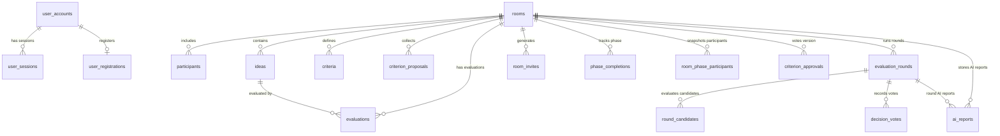

# WhyNot 프로젝트 ERD 및 데이터베이스 스키마 명세서 (ERD Schema Reference)

본 문서는 프로젝트의 전체 ERD(Entity Relationship Diagram)와 데이터베이스 테이블 및 컬럼 구조를 정의하는 레퍼런스 명세서입니다.  
버그/오류 수정 및 기능 개발 시 본 명세서를 참조하여 어떤 테이블과 컬럼이 직/간접적으로 영향을 받는지 검증해야 합니다.

---

## 📊 1. ERD 개요 및 테이블 목록 (총 17개 테이블)

---

## 🗂️ 2. 테이블별 세부 스키마 (Tables & Columns)

### 1. `rooms` (의사결정 방 마스터)
| 컬럼명 | 데이터 타입 | 제약 조건 / 기본값 | 설명 |
| :--- | :--- | :--- | :--- |
| `id` | `TEXT` | PRIMARY KEY | 방 고유 식별자 (UUID 또는 문자열 ID) |
| `title` | `TEXT` | NOT NULL | 방 제목 |
| `description` | `TEXT` | DEFAULT '' | 방 설명/목적 |
| `category` | `TEXT` | DEFAULT '기획' | 카테고리 |
| `is_public` | `BOOLEAN` | DEFAULT false | 공개 방 여부 |
| `max_participants` | `INT` | DEFAULT 6 | 최대 참여자 수 |
| `target_winner_count` | `INT` | DEFAULT 1 | 목표 최종 선정 아이디어 수 |
| `is_pinned` | `BOOLEAN` | DEFAULT false | 상단 고정 여부 |
| `host_id` | `TEXT` | NOT NULL | 방장(생성자) 사용자 ID |
| `status` | `TEXT` | DEFAULT 'IDEA_SUBMISSION' | 현재 진행 상태 (IDEA_SUBMISSION, CRITERIA_SETTING, EVALUATION, COMPLETED 등) |
| `min_response_threshold` | `INT` | DEFAULT 1 | 최소 응답/투표 임계치 |
| `elimination_config` | `JSONB` | DEFAULT '{"countPerRound": 1, "tieBreak": "random"}' | 라운드별 탈락 설정 |
| `deadlines` | `JSONB` | DEFAULT '{}' | 페이즈별 마감시한 |
| `engine_version` | `INT` | NOT NULL DEFAULT 3 | 의사결정 엔진 버전 |
| `decision_mode` | `TEXT` | NOT NULL DEFAULT 'STRUCTURED' | 의사결정 모드 ('STRUCTURED', 'QUICK') |
| `final_vote_status` | `TEXT` | NOT NULL DEFAULT 'NOT_STARTED' | 최종 투표 진행 상태 |
| `tie_candidate_idea_ids` | `TEXT[]` | NOT NULL DEFAULT ARRAY[] | 동점 후보 아이디어 ID 목록 |
| `tie_slots` | `INT` | NOT NULL DEFAULT 0 | 동점 발생 슬롯 수 |
| `current_round_id` | `TEXT` | NULL | 현재 진행 중인 라운드 ID |
| `criteria_set_version` | `INT` | NOT NULL DEFAULT 1 | 현재 적용된 평가 기준 버전 |
| `created_at` | `TIMESTAMPTZ`| DEFAULT NOW() | 방 생성 일시 |

---

### 2. `participants` (방 참여자 목록)
| 컬럼명 | 데이터 타입 | 제약 조건 / 기본값 | 설명 |
| :--- | :--- | :--- | :--- |
| `room_id` | `TEXT` | PK, FK (`rooms.id` ON DELETE CASCADE) | 방 ID |
| `user_id` | `TEXT` | PK | 참여자 사용자 ID |
| `nickname` | `TEXT` | NOT NULL | 해당 방에서 사용하는 닉네임 |
| `joined_at` | `TIMESTAMPTZ`| DEFAULT NOW() | 방 참여 일시 |
| `hidden_at` | `TIMESTAMPTZ`| NULL | 사용자 목록에서 방 숨김 처리 일시 |

---

### 3. `ideas` (제출된 후보 아이디어)
| 컬럼명 | 데이터 타입 | 제약 조건 / 기본값 | 설명 |
| :--- | :--- | :--- | :--- |
| `id` | `TEXT` | PRIMARY KEY | 아이디어 고유 ID |
| `room_id` | `TEXT` | FK (`rooms.id` ON DELETE CASCADE) | 소속 방 ID |
| `title` | `TEXT` | NOT NULL | 아이디어 제목 |
| `description` | `TEXT` | DEFAULT '' | 상세 설명 |
| `submitter_id` | `TEXT` | NOT NULL | 제출자 사용자 ID |
| `submitter_name` | `TEXT` | DEFAULT '익명 아이디어' | 제출자 표시 이름 |
| `attachment_url` | `TEXT` | NULL | 첨부파일 URL |
| `pdf_attachment_url` | `TEXT` | NULL | PDF 첨부파일 URL |
| `tags` | `TEXT[]` | DEFAULT ARRAY[] | 아이디어 태그 |
| `status` | `TEXT` | DEFAULT 'ACTIVE' | 아이디어 상태 ('ACTIVE', 'ELIMINATED', 'WINNER') |
| `eliminated_round` | `INT` | NULL | 탈락된 라운드 번호 |
| `revealed_at` | `TIMESTAMPTZ`| NULL | 제출자 공개 시점 |
| `created_at` | `TIMESTAMPTZ`| DEFAULT NOW() | 생성 일시 |

---

### 4. `criteria` (평가 기준)
| 컬럼명 | 데이터 타입 | 제약 조건 / 기본값 | 설명 |
| :--- | :--- | :--- | :--- |
| `id` | `TEXT` | PRIMARY KEY | 평가 기준 ID |
| `room_id` | `TEXT` | FK (`rooms.id` ON DELETE CASCADE) | 방 ID |
| `name` | `TEXT` | NOT NULL | 기준 명칭 (예: 비용, 효과성, 실현가능성) |
| `description` | `TEXT` | DEFAULT '' | 기준 설명 |
| `weight` | `NUMERIC` | DEFAULT 1.0 | 기준 가중치 |
| `confirmed` | `BOOLEAN` | DEFAULT false | 최종 확정 여부 |
| `created_at` | `TIMESTAMPTZ`| DEFAULT NOW() | 생성 일시 |

---

### 5. `criterion_proposals` (평가 기준 제안)
| 컬럼명 | 데이터 타입 | 제약 조건 / 기본값 | 설명 |
| :--- | :--- | :--- | :--- |
| `id` | `TEXT` | PRIMARY KEY | 제안 ID |
| `room_id` | `TEXT` | FK (`rooms.id` ON DELETE CASCADE) | 방 ID |
| `proposer_id` | `TEXT` | NOT NULL | 제안자 ID |
| `raw_text` | `TEXT` | NOT NULL | 원본 제안 텍스트 |
| `parsed_name` | `TEXT` | NULL | 파싱/정리된 기준 이름 |
| `status` | `TEXT` | DEFAULT 'PENDING' | 제안 상태 ('PENDING', 'ACCEPTED', 'REJECTED') |
| `is_ai_suggested` | `BOOLEAN` | DEFAULT false | AI 추천 기준 여부 |
| `revealed_at` | `TIMESTAMPTZ`| NULL | 공개 시점 |
| `created_at` | `TIMESTAMPTZ`| DEFAULT NOW() | 생성 일시 |

---

### 6. `evaluations` (아이디어 평가 및 점수 기록)
| 컬럼명 | 데이터 타입 | 제약 조건 / 기본값 | 설명 |
| :--- | :--- | :--- | :--- |
| `id` | `TEXT` | PRIMARY KEY | 평가 기록 ID |
| `room_id` | `TEXT` | FK (`rooms.id` ON DELETE CASCADE) | 방 ID |
| `evaluator_id` | `TEXT` | NOT NULL | 평가자 사용자 ID |
| `idea_id` | `TEXT` | FK (`ideas.id` ON DELETE CASCADE) | 대상 아이디어 ID |
| `decision` | `TEXT` | NOT NULL | 평가 결정 값 |
| `excluded_criterion_ids` | `TEXT[]` | DEFAULT ARRAY[] | 제외된 평가 기준 ID 목록 |
| `criteria_evaluations` | `JSONB` | DEFAULT '{}' | 기준별 상세 점수 JSON |
| `reason_text` | `TEXT` | DEFAULT '' | 평가 이유 / 사유 |
| `reason_type` | `TEXT` | DEFAULT 'PREFERENCE' | 평가 이유 유형 |
| `round` | `INT` | DEFAULT 1 | 평가 라운드 번호 |
| `round_id` | `TEXT` | NULL | 연결된 라운드 ID (`evaluation_rounds.id`) |
| `created_at` | `TIMESTAMPTZ`| DEFAULT NOW() | 평가 일시 |

---

### 7. `user_accounts` (사용자 계정 정보)
| 컬럼명 | 데이터 타입 | 제약 조건 / 기본값 | 설명 |
| :--- | :--- | :--- | :--- |
| `id` | `UUID` | PRIMARY KEY DEFAULT gen_random_uuid() | 사용자 고유 ID |
| `login_id` | `TEXT` | UNIQUE, NOT NULL | 로그인 아이디 |
| `password_hash` | `TEXT` | NOT NULL | 해시화된 비밀번호 |
| `nickname` | `TEXT` | NOT NULL | 기본 닉네임 |
| `recovery_code_hash` | `TEXT` | NOT NULL | 복구 코드 해시 |
| `status` | `TEXT` | DEFAULT 'ACTIVE' CHECK ('ACTIVE', 'SUSPENDED', 'DELETED') | 계정 상태 |
| `failed_recovery_attempts` | `INT` | DEFAULT 0 | 복구 시도 실패 횟수 |
| `created_at` | `TIMESTAMPTZ`| DEFAULT NOW() | 가입 일시 |
| `updated_at` | `TIMESTAMPTZ`| DEFAULT NOW() | 정보 수정 일시 |

---

### 8. `user_sessions` (사용자 로그인 세션)
| 컬럼명 | 데이터 타입 | 제약 조건 / 기본값 | 설명 |
| :--- | :--- | :--- | :--- |
| `id` | `UUID` | PRIMARY KEY DEFAULT gen_random_uuid() | 세션 ID |
| `user_id` | `UUID` | FK (`user_accounts.id` ON DELETE CASCADE) | 계정 ID |
| `token_hash` | `TEXT` | UNIQUE, NOT NULL | 인증 토큰 해시 |
| `expires_at` | `TIMESTAMPTZ`| NOT NULL | 만료 일시 |
| `created_at` | `TIMESTAMPTZ`| DEFAULT NOW() | 세션 생성 일시 |

---

### 9. `user_registrations` (회원 가입 이력)
| 컬럼명 | 데이터 타입 | 제약 조건 / 기본값 | 설명 |
| :--- | :--- | :--- | :--- |
| `user_id` | `UUID` | PK, FK (`user_accounts.id` ON DELETE CASCADE) | 계정 ID |
| `login_id` | `TEXT` | UNIQUE, NOT NULL | 로그인 아이디 |
| `nickname` | `TEXT` | NOT NULL | 가입 당시 닉네임 |
| `registration_status` | `TEXT` | DEFAULT 'COMPLETED' CHECK ('COMPLETED', 'CANCELLED') | 가입 상태 |
| `registered_at` | `TIMESTAMPTZ`| DEFAULT NOW() | 가입 처리 일시 |

---

### 10. `room_invites` (방 초대 정보)
| 컬럼명 | 데이터 타입 | 제약 조건 / 기본값 | 설명 |
| :--- | :--- | :--- | :--- |
| `id` | `UUID` | PRIMARY KEY DEFAULT gen_random_uuid() | 초대 ID |
| `room_id` | `TEXT` | FK (`rooms.id` ON DELETE CASCADE) | 방 ID |
| `invite_token` | `TEXT` | UNIQUE, NULL | 초대 토큰 |
| `invite_token_hash` | `TEXT` | UNIQUE, NULL | 초대 토큰 해시 |
| `created_by` | `TEXT` | NOT NULL | 초대 생성자 사용자 ID |
| `expires_at` | `TIMESTAMPTZ`| NOT NULL | 초대 만료 일시 |
| `is_active` | `BOOLEAN` | DEFAULT true | 활성화 여부 |
| `created_at` | `TIMESTAMPTZ`| DEFAULT NOW() | 생성 일시 |

---

### 11. `phase_completions` (페이즈 완료 기록)
| 컬럼명 | 데이터 타입 | 제약 조건 / 기본값 | 설명 |
| :--- | :--- | :--- | :--- |
| `room_id` | `TEXT` | PK, FK (`rooms.id` ON DELETE CASCADE) | 방 ID |
| `phase` | `TEXT` | PK | 페이즈 명칭 (e.g., 'IDEA_SUBMISSION') |
| `user_id` | `TEXT` | PK | 완료한 사용자 ID |
| `completed_at` | `TIMESTAMPTZ`| DEFAULT NOW() | 완료 시각 |

---

### 12. `room_phase_participants` (페이즈 참여자 스냅샷)
| 컬럼명 | 데이터 타입 | 제약 조건 / 기본값 | 설명 |
| :--- | :--- | :--- | :--- |
| `room_id` | `TEXT` | PK, FK (`rooms.id` ON DELETE CASCADE) | 방 ID |
| `phase` | `TEXT` | PK | 페이즈 명칭 |
| `user_id` | `TEXT` | PK | 스냅샷된 사용자 ID |
| `created_at` | `TIMESTAMPTZ`| DEFAULT NOW() | 스냅샷 일시 |

---

### 13. `criterion_approvals` (평가 기준 동의/수정 투표)
| 컬럼명 | 데이터 타입 | 제약 조건 / 기본값 | 설명 |
| :--- | :--- | :--- | :--- |
| `room_id` | `TEXT` | PK, FK (`rooms.id` ON DELETE CASCADE) | 방 ID |
| `criteria_set_version` | `INT` | PK | 기준 버전 번호 |
| `user_id` | `TEXT` | PK | 사용자 ID |
| `vote` | `TEXT` | NOT NULL CHECK ('APPROVE', 'REVISE') | 투표 결과 |
| `created_at` | `TIMESTAMPTZ`| DEFAULT NOW() | 투표 일시 |
| `updated_at` | `TIMESTAMPTZ`| DEFAULT NOW() | 수정 일시 |

---

### 14. `evaluation_rounds` (평가 라운드 관리)
| 컬럼명 | 데이터 타입 | 제약 조건 / 기본값 | 설명 |
| :--- | :--- | :--- | :--- |
| `id` | `TEXT` | PRIMARY KEY | 라운드 고유 ID |
| `room_id` | `TEXT` | FK (`rooms.id` ON DELETE CASCADE) | 방 ID |
| `round_number` | `INT` | NOT NULL CHECK (>= 1) | 라운드 회차 (1, 2, 3...) |
| `decision_mode` | `TEXT` | NOT NULL CHECK ('STRUCTURED', 'QUICK') | 해당 라운드 진행 방식 |
| `status` | `TEXT` | DEFAULT 'ACTIVE' CHECK ('ACTIVE', 'COMPLETED') | 라운드 상태 |
| `started_at` | `TIMESTAMPTZ`| DEFAULT NOW() | 시작 일시 |
| `completed_at` | `TIMESTAMPTZ`| NULL | 종료/완료 일시 |
| `result_snapshot` | `JSONB` | DEFAULT '{}' | 라운드 최종 계산 결과 스냅샷 |

---

### 15. `round_candidates` (라운드별 대상 후보 및 생존 상태)
| 컬럼명 | 데이터 타입 | 제약 조건 / 기본값 | 설명 |
| :--- | :--- | :--- | :--- |
| `id` | `TEXT` | PRIMARY KEY | 기록 ID |
| `room_id` | `TEXT` | FK (`rooms.id` ON DELETE CASCADE) | 방 ID |
| `round_id` | `TEXT` | FK (`evaluation_rounds.id` ON DELETE CASCADE) | 라운드 ID |
| `idea_id` | `TEXT` | NOT NULL | 후보 아이디어 ID |
| `outcome` | `TEXT` | DEFAULT 'ACTIVE' CHECK ('ACTIVE', 'ELIMINATED', 'WINNER') | 라운드 결과 |
| `created_at` | `TIMESTAMPTZ`| DEFAULT NOW() | 등록 일시 |

---

### 16. `decision_votes` (의사결정 투표)
| 컬럼명 | 데이터 타입 | 제약 조건 / 기본값 | 설명 |
| :--- | :--- | :--- | :--- |
| `id` | `TEXT` | PRIMARY KEY | 투표 ID |
| `room_id` | `TEXT` | FK (`rooms.id` ON DELETE CASCADE) | 방 ID |
| `round_id` | `TEXT` | FK (`evaluation_rounds.id` ON DELETE CASCADE) | 라운드 ID |
| `user_id` | `TEXT` | NOT NULL | 투표자 ID |
| `selected_idea_ids` | `TEXT[]` | NOT NULL CHECK (cardinality >= 1) | 선택한 아이디어 ID 배열 |
| `created_at` | `TIMESTAMPTZ`| DEFAULT NOW() | 투표 일시 |

---

### 17. `ai_reports` (AI 리포트 저장)
| 컬럼명 | 데이터 타입 | 제약 조건 / 기본값 | 설명 |
| :--- | :--- | :--- | :--- |
| `id` | `TEXT` | PRIMARY KEY | 리포트 ID |
| `room_id` | `TEXT` | FK (`rooms.id` ON DELETE CASCADE) | 방 ID |
| `round_id` | `TEXT` | NULL, FK (`evaluation_rounds.id` ON DELETE CASCADE) | 라운드 ID |
| `report_text` | `TEXT` | NOT NULL | 생성된 AI 분석 보고서 본문 |
| `input_snapshot` | `JSONB` | DEFAULT '{}' | AI 프롬프트 입력 데이터 스냅샷 |
| `result_snapshot` | `JSONB` | DEFAULT '{}' | AI 응답 결과 구조체 스냅샷 |
| `model_name` | `TEXT` | NOT NULL | 사용된 AI 모델명 (e.g., gemini-2.5-flash) |
| `prompt_version` | `TEXT` | NOT NULL | 프롬프트 버전 문자열 |
| `created_at` | `TIMESTAMPTZ`| DEFAULT NOW() | 생성 일시 |

---

## 🔄 3. 작업 시 영향도 평가 체크리스트 (Impact Analysis Checklist)

새로운 기능을 추가하거나 버그/오류를 수정할 때 아래 4가지 관점에서 DB 영향을 반드시 확인하고 설명해야 합니다.

1. **직접 변경 테이블 & 컬럼 (Direct Mutation Table & Column)**
   - `INSERT`, `UPDATE`, `DELETE` 가 일어나는 테이블과 특정 컬럼
2. **조회 및 조건검색 영향 (Query & Index Impact)**
   - `SELECT` 조건문(`WHERE`), `JOIN`, `ORDER BY` 변경으로 영향을 받는 컬럼 및 인덱스
3. **연관 외래키 및 종속성 (Foreign Key & Cascades)**
   - `ON DELETE CASCADE`로 인해 같이 삭제되는 하위 데이터 (`rooms` 삭제 시 `ideas`, `evaluations`, `participants` 등 연쇄 삭제)
4. **상태값 / JSONB 내부 구조 (State & Semi-structured Schema)**
   - `rooms.status`, `ideas.status`, `round_candidates.outcome` 등의 ENUM / TEXT 상태값 변경
   - `rooms.elimination_config`, `evaluations.criteria_evaluations`, `ai_reports.result_snapshot` 등 `JSONB` 내부 구조 변경 여부
